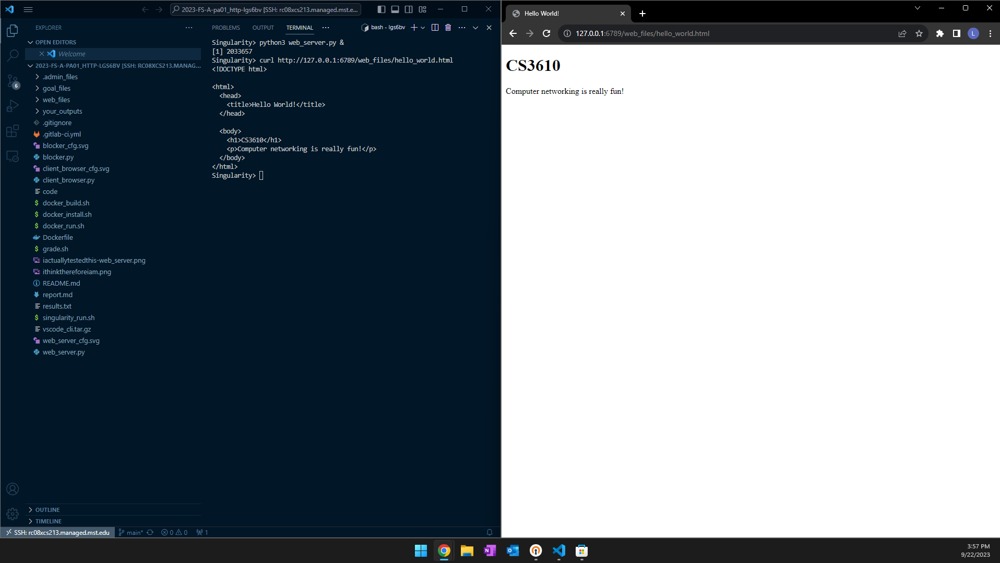
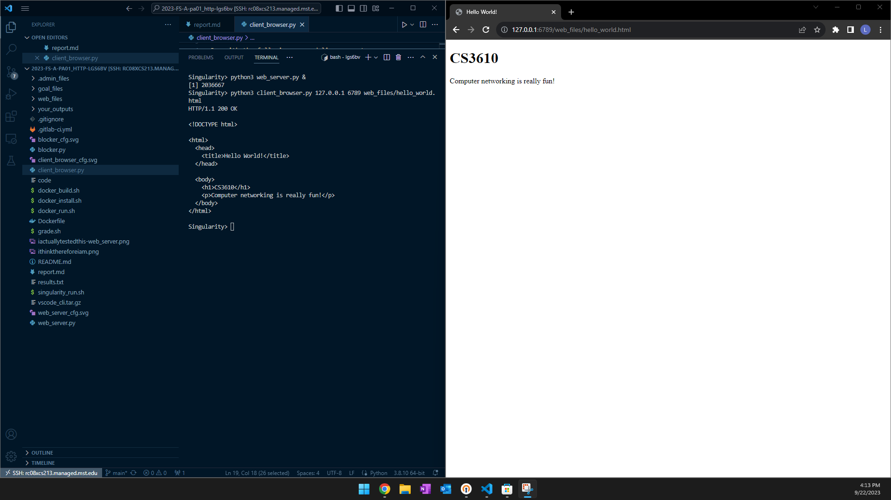

# CS 3610 pa01

## Testing Web Server

When the server is running I can access it from chrome on my windows machine

## Testing Client Browser

When the client browser is ran I can see the output of the specified page in the terminal which matches the chrome instance of the same page on my windows machine

## Notes
I used VSCode to ssh into a campus linux machine. After connecting, I was able to edit my code from my windows machine and run the code inside the docker container on the linux machine.