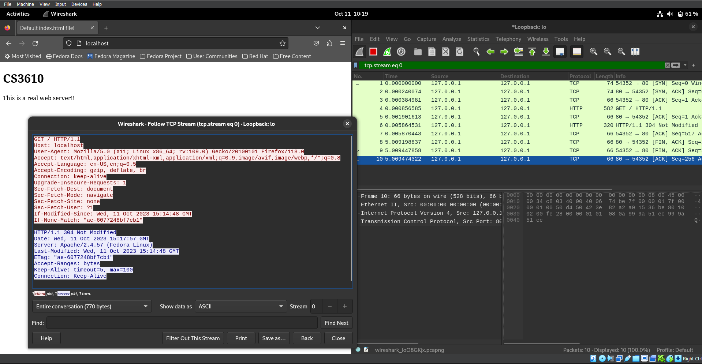

# Apache Web Server Report

## Is the traffic TCP or UDP?
The traffic uses the TCP protocol.

## Follow a TCP stream
The Wireshark screenshot below shows a follow of the TCP stream after running 'sh apache_setup.sh'

### This screen shows three different windows:
* The wireshark instance capturing data on the localhost (right)
* A follow of the TCP stream (middle left)
* Firefox browser with the webpage open (top left)

## Can you read the HTTP data?
Since the data is unencrypted, I am able to read all of the HTTP data.

## Is it encrypted?
No, but it could be if I spent the time to set it up.

## Description of Setup
To complete this lab, a fresh VM running Fedora with a shared folder was created. An Apache web server was installed and setup. Snapshots on the VM were used to ensure that the autograder would not give false information. 